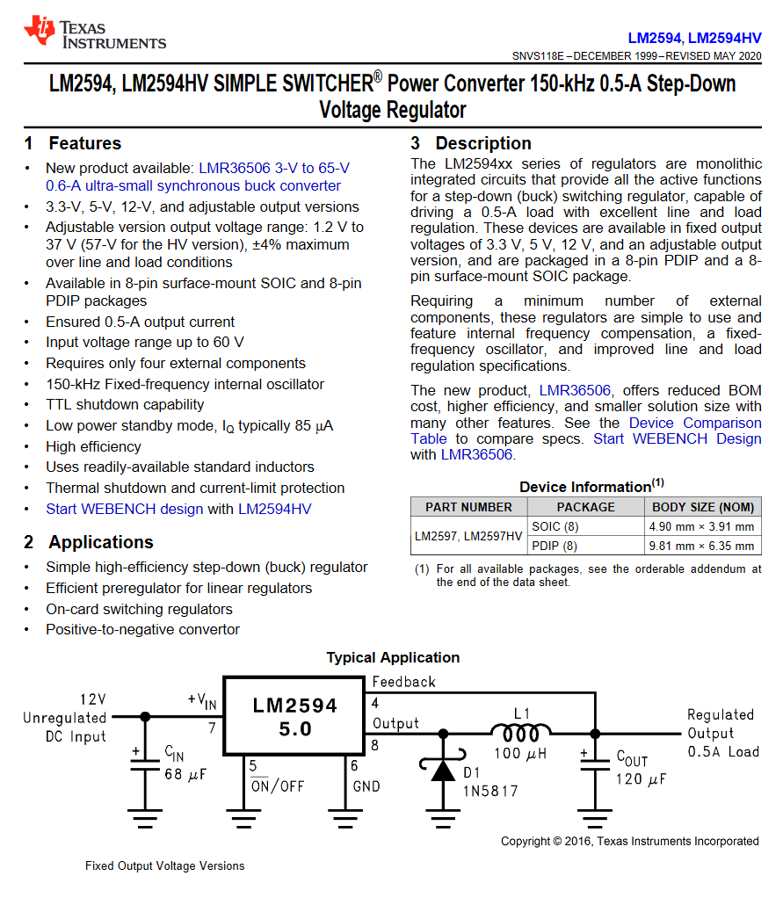

# 24V-5V DC-DC power supply

---

Name: <!-- TODO: place nam here -->

---

For applications that require a 5V power supply, but only have a 7-24V power supply, a DC-DC converter is needed. A commons DC-DC converter is the `LM2594`. This converter is rated up to 500mA and is very efficient step down down regulator.

Features:

- [ ] All components should be SMD, except for pinheaders and connectors
  - [ ] Use 0805 for resistors and capacitors ([Wikipedia](https://en.wikipedia.org/wiki/Surface-mount_technology#Packages))
  - [ ] Large capacitor values (>10µF) can use other SMD packages (1206 or larger)
  - [ ] Terminal blocks are male 5.08 mm (0.2 inch) pitched ([Farnell](https://be.farnell.com/camdenboss/ctb0508-2/terminal-block-wire-to-brd-2pos/dp/2315262?), use `bornier` type footprints in KiCad)
- [ ] Add a power-led to visualize the state of the circuit.
- [ ] Use the [datasheets](https://www.ti.com/lit/ds/symlink/lm2594.pdf?ts=1615275865212&ref_url=https%253A%252F%252Fwww.ti.com%252Fproduct%252FLM2594) reference design, read the datasheet for notes and details.
- [ ] The output voltage should be a fixed 5V, not variable.

## Schematic

 <!-- TODO: Remove draft image when done -->

<!-- TODO: place image here -->

## PCB

| Front | Back |
|---|---|
| <!-- TODO: place image here (3D view) --> | <!-- TODO: place image here (3D view) --> |

## BOM

The BOM or Bill of Materials consists out of a list of all the components with some of their properties.

| Designator | Quantity | Description | Footprint | Farnell ordercode | Price |
|---|---|---|---|---|---|
| C1, C4 | 2 | 100nF | 0805 | [123456](https://be.farnell.com/raspberry-pi/rpi4-modbp-4gb/raspberry-pi-4-model-b-4gb/dp/3051887?ICID=I-HP-PP-RASPBERRY-PI-SEP_20-WF2293904) | 0.0012 € | <!-- TODO: remove this example -->
|||||||
|||||||

Total price: <!-- TODO: calculate total price -->
